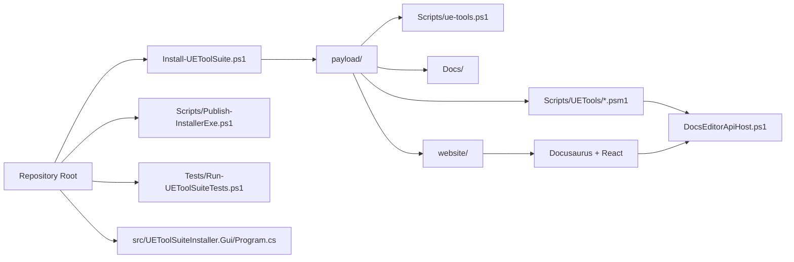
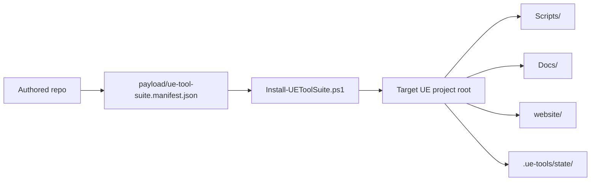
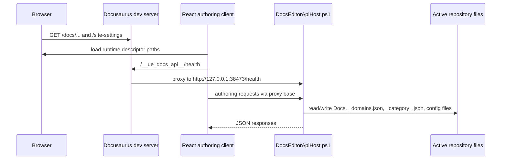
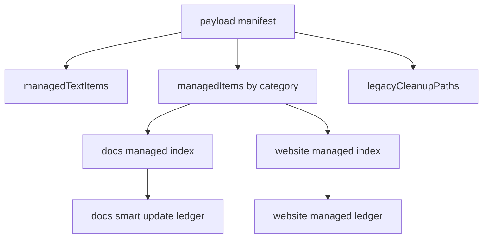
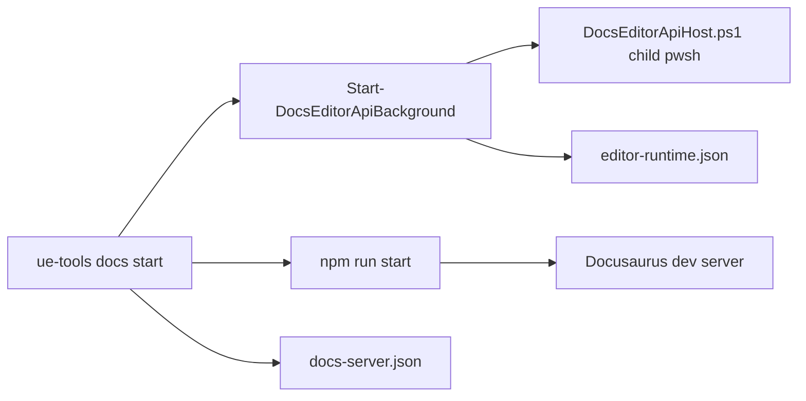
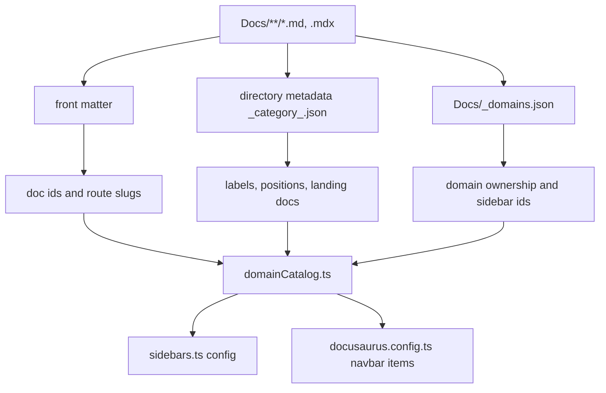

# Architecture

## High-level shape

The repository is split between a root installer/release layer and an installed payload layer. The docs-authoring system then adds a third runtime split inside the installed project: browser frontend, local Docusaurus dev server, and a loopback PowerShell API.

## Component architecture

Explanation:

- The root installer selects and copies payload content.
- The GUI wrapper packages the same installer and payload instead of replacing them.
- After installation, the project-local command surface is `Scripts/ue-tools.ps1` plus nested modules.
- The docs site and docs API are coupled but still split into frontend and PowerShell transport layers.

## Source repository to installed-project deployment

Explanation:

- `payload/ue-tool-suite.manifest.json` defines category membership and legacy cleanup paths.
- `Install-UEToolSuite.ps1` applies manifest categories plus command-line switches to compute the effective install set.
- `Docs/` and `website/` are not treated identically: docs use a smart-update ledger/candidate model, while website installation also merges structured config and tracks managed build assets.

## Browser to Docusaurus proxy to Editor API

Explanation:

- The development proxy is declared in `payload/website/docusaurus.config.ts`.
- The frontend still validates runtime identity and does not blindly trust any responding loopback service.
- The API writes directly to repository files; there is no database or remote service layer.

## Installer and managed-file ownership

Explanation:

- Root text files are marker-managed instead of wholly replaced.
- Docs and website each have separate managed-file indexes and target ledgers.
- The website ledger also governs cleanup of obsolete managed build assets.

## Runtime process ownership

Explanation:

- The docs module owns both the dev server state and the editor API state.
- Background start writes tracked state files under `.ue-tools/state/**` and `website/static/ue-tools/editor-runtime.json`.
- Stop/status logic attempts to reconcile tracked state with live processes and live `/health` responses.

## Docs content and generated navigation relationships

Explanation:

- `domainCatalog.ts` is the central authored-side synthesis step for docs routes, labels, and sidebars.
- `sidebars.ts` is intentionally thin and delegates to `buildDocsSidebarsConfig()`.
- The Site Settings tree and the generated Docusaurus sidebar are related but not identical views; the tree includes mutable structure state, while the sidebar is derived from the docs/domain model.

## Key boundaries

| Boundary | Primary source | Why it matters |
|---|---|---|
| installer vs payload | `Install-UEToolSuite.ps1` vs `payload/**` | Source repo decides updates; installed payload does not self-update |
| CLI dispatch vs domain logic | `payload/Scripts/ue-tools.ps1`, `UEToolSuite.Dispatcher.psm1` | Public command surface stays stable while implementation changes inside modules |
| docs frontend vs docs transport | `payload/website/src/**` vs `DocsEditorApiHost.ps1` | UI state and filesystem mutation are intentionally separate |
| authored source vs generated state | `payload/website/src/**` vs `website/build/**`, `.ue-tools/state/**` | Bugs often come from drift between these layers |
| release packaging vs install runtime | `Program.cs`, `.csproj`, `Publish-InstallerExe.ps1` | GUI packaging contracts do not define project-local runtime behavior by themselves |
