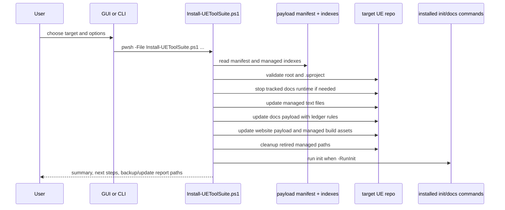

# Installation and Updates

## Entry points

- CLI installer: `Install-UEToolSuite.ps1`
- GUI launcher: `src/UEToolSuiteInstaller.Gui/Program.cs`
- Publish wrapper: `Scripts/Publish-InstallerExe.ps1`

The GUI does not contain a separate installer engine. It constructs arguments and launches `pwsh.exe -File Install-UEToolSuite.ps1 ...`.

## Accepted installer parameters

The installer parameter block starts at `Install-UEToolSuite.ps1:4` and includes these notable groups:

- target selection: `-TargetRepoRoot`, `-PayloadRoot`, `-TargetUProjectPath`
- website behavior: `-WebsiteInstallMode`, `-WebsiteTheme`, branding paths, force-suite/project path arrays, `-AdoptExistingWebsite`
- init forwarding: `-RunInit`, `-InitNonInteractive`, `-SkipLfsPull`, `-SkipDocsSetup`, `-SkipDocsNpmInstall`, `-ForceDocsNpmInstall`, `-SkipDocsBridgeInstall`, `-SkipUnrealSync`, `-NoBuild`, `-NoRegen`
- payload scope: `-SkipDocs`, `-SkipWebsite`, `-SkipTests`, `-SkipAITools`, `-SkipArtSourceTools`, `-SkipCodingStandardsTools`
- safety/control: `-NoBackup`, `-NoLegacyCleanup`, `-SkipDocsSectionMigration`

## Installer phases

| Phase | Responsible function or block | Inputs | Outputs / effects | Associated tests |
|---|---|---|---|---|
| Resolve roots and target | `Resolve-ExistingDirectory`, `Resolve-TargetUProjectPath`, `Test-TargetLooksLikeUE5Project` | target repo path, optional `.uproject` | validated repo root and `.uproject` path | `Tests/Test-Install-UEToolSuite.ps1` Case 1, Case 3 |
| Read install contract | `Read-UEToolSuitePayloadManifest` | `payload/ue-tool-suite.manifest.json` | manifest object with managed categories | installer Case 1, packaging contracts |
| Optional runtime shutdown | `Stop-InstalledDocsRuntimeIfPresent` | target repo root | stop/remove tracked docs runtime state before update | installer Case 2e |
| Managed text update | marker helpers around `.gitattributes`/`.gitignore` | manifest `managedTextItems` | marker blocks refreshed without full-file replace | installer Case 1, Case 2 |
| Managed payload selection | `$managedItems` list build at `Install-UEToolSuite.ps1:2678-2730` | manifest categories plus skip flags | effective install/update set | installer Case 4-7 |
| Docs smart update | `Invoke-ManagedDocsSmartUpdate` | docs index, ledger, overrides | auto-update, preserve customized files, emit candidates/reports | installer Case 2, 2c, 2d, 2f |
| Website install/update | website ledger helpers, `Merge-WebsitePackageJson`, website indexed file copy/remove helpers | website index, overrides, install mode | merge package config, copy/update build/source assets, cleanup obsolete managed assets | installer Case 1, 2f, 2g, 5g, 5h |
| Legacy cleanup | `legacyCleanupPaths` application | manifest list | removes retired managed paths unless `-NoLegacyCleanup` | installer Case 2, Case 7 |
| Optional init | `if ($RunInit)` block at `Install-UEToolSuite.ps1:2828` | forwarded switches | runs installed `ue-tools init` flow | installer Case 3 |

## Install sequence

## File selection and copy/removal model

- Manifest category membership comes from `payload/ue-tool-suite.manifest.json`.
- Docs and website source membership is refined by `payload/docs-managed-file-index.json` and `payload/website-managed-file-index.json`.
- The installer writes target ledgers under `.ue-tools/state/docs-managed-ledger.json` and `.ue-tools/state/website-managed-ledger.json`.
- Backup copies go under `.ue-tools-installer-backups/<timestamp>/` unless `-NoBackup` is set.
- Customized docs defaults that are not safe to auto-overwrite are preserved and payload candidates are written under `.ue-tools-installer-updates/<timestamp>/`.

## Error behavior and partial failure model

Confirmed behavior:

- The installer uses terminating errors (`$ErrorActionPreference = "Stop"`).
- Several writes are guarded by path-inside-root checks.
- Partial state is possible because the installer performs many file operations before the optional init phase.
- Backups exist to recover many replaced managed files, but recovery is not globally transactional.

> Confirmed non-atomic areas: docs smart update candidate generation, website indexed file replacement, and any install that reaches `-RunInit` after payload writes.

## Idempotency

The current checkout explicitly tests several idempotent or repeatable paths:

- rerunning installer after section migration (installer Case 2e)
- managed git metadata cleanup and rerun behavior (installer Case 2g)
- repeated background docs start reuse (docs-tools Case 5c)

The install is designed to be rerun, but only some subflows are strongly guarded by tests.

## Uninstall and rollback

- There is no dedicated full uninstall entrypoint in the current repo.
- Recovery is backup-oriented, not uninstall-oriented.
- Legacy cleanup only removes paths listed in `legacyCleanupPaths` or obsolete managed-file ledger entries.

## Logging

- Installer messages are printed with `[UE Tool Suite Installer]` prefixes.
- GUI progress parsing in `Program.cs` watches those lines to update the progress bar.
- Test harnesses capture logs in `*Results/` directories.

## Files that define installer behavior

- `Install-UEToolSuite.ps1`
- `payload/ue-tool-suite.manifest.json`
- `payload/docs-managed-file-index.json`
- `payload/website-managed-file-index.json`
- `Tests/Test-Install-UEToolSuite.ps1`
- `Tests/Test-PackagingContracts.ps1`
- `src/UEToolSuiteInstaller.Gui/Program.cs`
