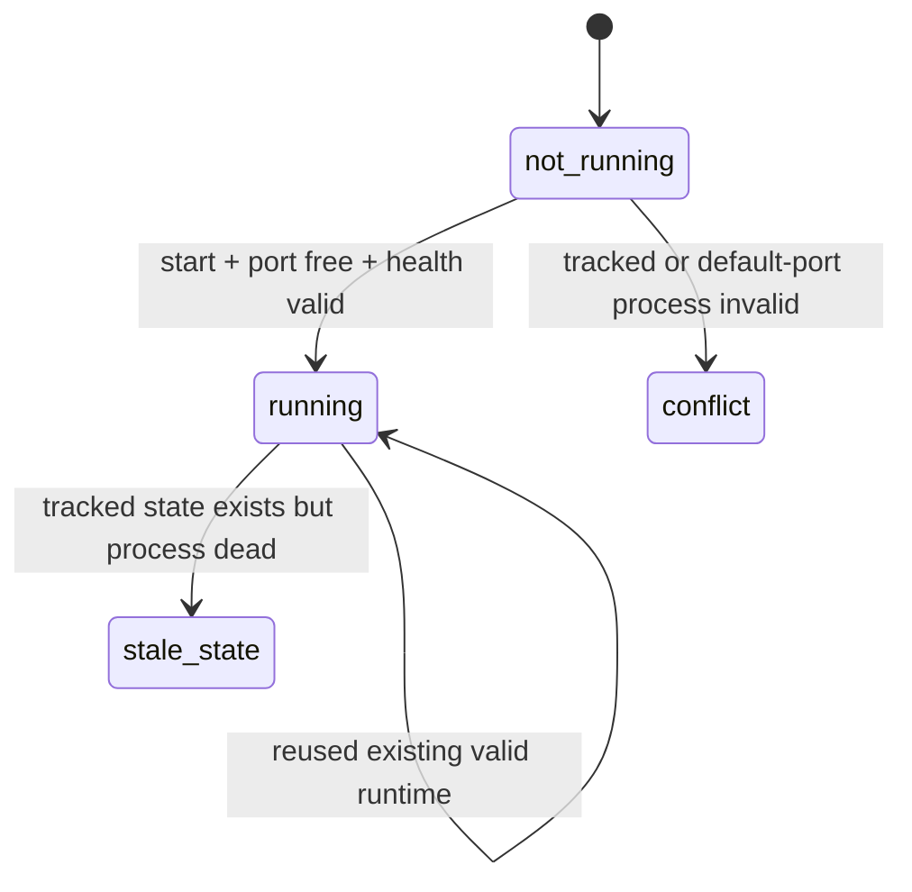
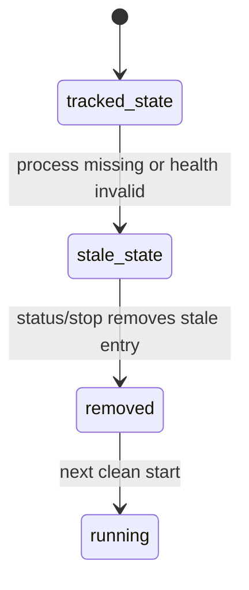
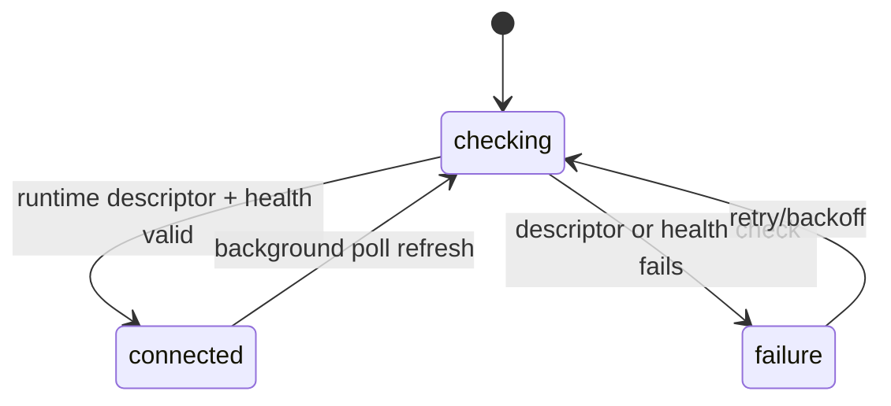

# Process Lifecycle

## Managed processes

UEToolSuite manages at least these process types in the docs subsystem:

- PowerShell host for `ue-tools docs`
- background PowerShell child running `DocsEditorApiHost.ps1`
- Node/npm process running the Docusaurus dev server
- optional VS Code bridge interactions through `code`

## Lifecycle owner

The lifecycle owner is `payload/Scripts/UETools/UEToolSuite.Docs.psm1`, not the frontend and not `DocsEditorApiHost.ps1` alone.

Key functions:

- `Get-DocsEditorApiStatus` (`UEToolSuite.Docs.psm1:4661`)
- `Start-DocsEditorApiBackground` (`UEToolSuite.Docs.psm1:4758`)
- `Stop-DocsEditorApiBackground` (`UEToolSuite.Docs.psm1:4949`)
- `Invoke-DocsStartForeground` (`UEToolSuite.Docs.psm1:5031`)
- `Invoke-DocsStartBackground` (`UEToolSuite.Docs.psm1:5067`)
- `Invoke-DocsStop` (`UEToolSuite.Docs.psm1:5203`)
- `Invoke-DocsStatus` (`UEToolSuite.Docs.psm1:5280`)

## State machine: API startup

## State machine: stale descriptor recovery

## State machine: frontend reconnection

## Foreground start

`Invoke-DocsStartForeground`:

1. resolve site URL from start args
2. start or reuse editor API
3. run `npm run start` in `website/`
4. if the editor API was newly started, stop it in `finally` after the foreground server exits

This is the simplest lifecycle path but it still depends on the background API helper for the editor API.

## Background start

`Invoke-DocsStartBackground`:

1. start or reuse editor API
2. prune stale tracked server entries
3. reject occupied requested docs port
4. spawn `npm run start` in a hidden PowerShell process
5. resolve tracked descendant/root PIDs
6. save `docs-server.json`
7. return URLs and log paths

## Runtime descriptor publication

The docs module writes `website/static/ue-tools/editor-runtime.json` with:

- API URL
- application id
- API version
- repo root
- docs root
- process id
- `startedAt`
- `generatedAt`

The frontend reads this descriptor before probing `/health`.

## Shutdown behavior

`Invoke-DocsStop`:

- stops tracked docs dev-server process trees
- stops tracked editor API runtime
- removes composite runtime state
- distinguishes `not_running`, `stopped`, `stopped_multiple`, and stale-state cleanup paths

## Current guarantees and gaps

Confirmed:

- default editor API port ownership is validated
- runtime health identity is checked against repo/docs roots
- stale tracked state is explicitly recognized
- background server reuse is tested

Not fully guaranteed:

- global atomic cleanup across all runtime files and all possible child-process shapes
- behavior when unsupported external launch paths write inconsistent runtime state
- behavior if a non-UEToolSuite process deliberately mimics the same health contract
