# Data Flows and Sequences

Each sequence below is intentionally narrow. It maps current source paths rather than an idealized architecture.

## 1. Fresh installation

Source anchors: `Install-UEToolSuite.ps1`, `payload/ue-tool-suite.manifest.json`, `Tests/Test-Install-UEToolSuite.ps1` Case `1`.

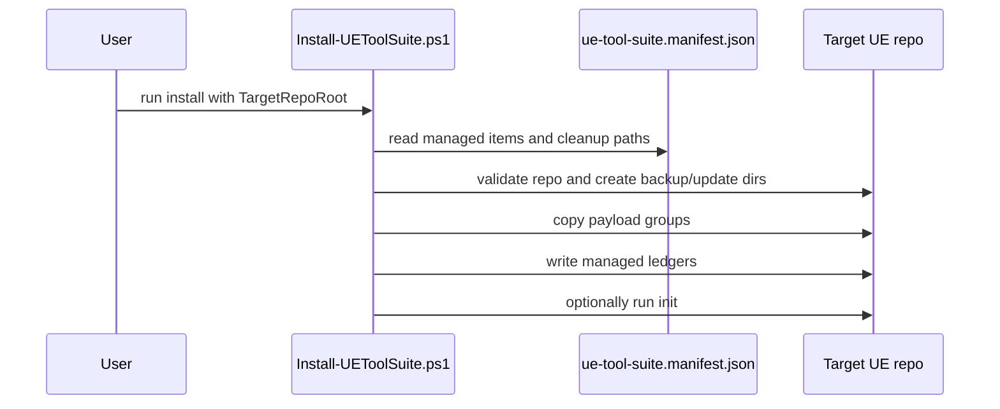

## 2. Update over an existing installation

Source anchors: `Invoke-ManagedDocsSmartUpdate`, `Read-ManagedWebsiteLedger`, installer Cases `2`-`2g`.

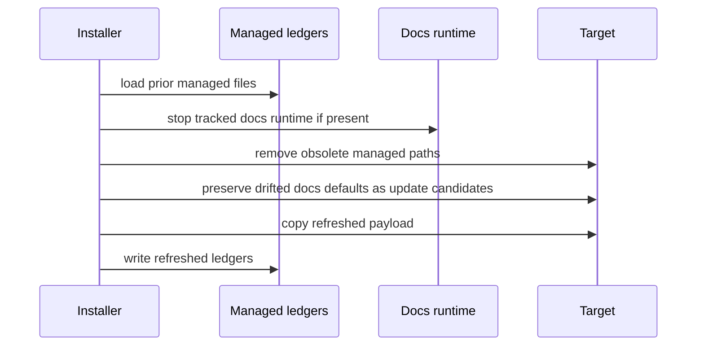

## 3. Docs foreground start

Source anchors: `Invoke-DocsStartForeground`, `Start-DocsEditorApiBackground`.

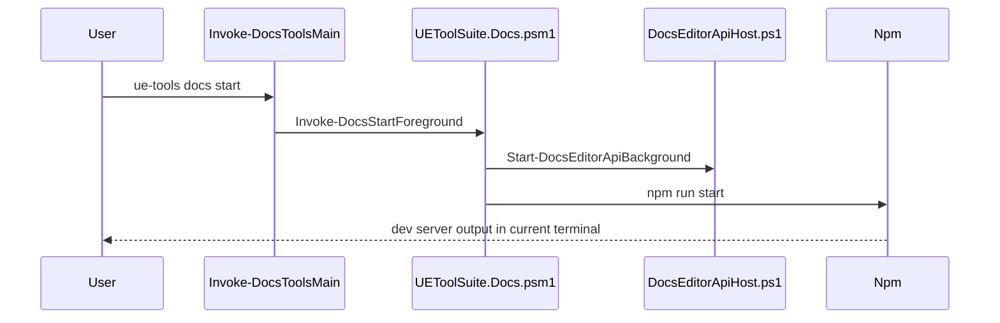

## 4. Docs background start

Source anchors: `Invoke-DocsStartBackground`, `Get-DocsServerEntries`.

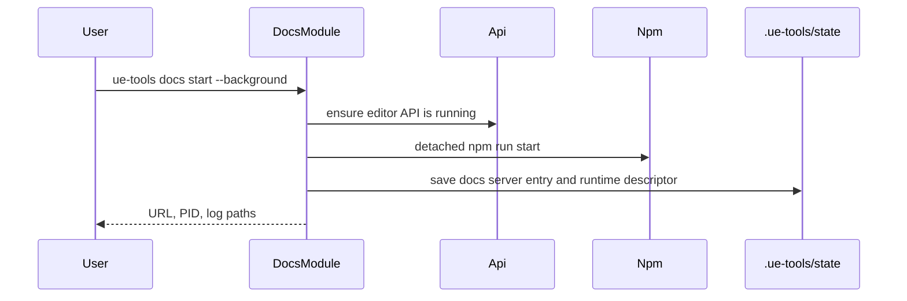

## 5. Runtime discovery

Source anchors: `runtimeDiscovery.ts`, `docusaurus.config.ts`.

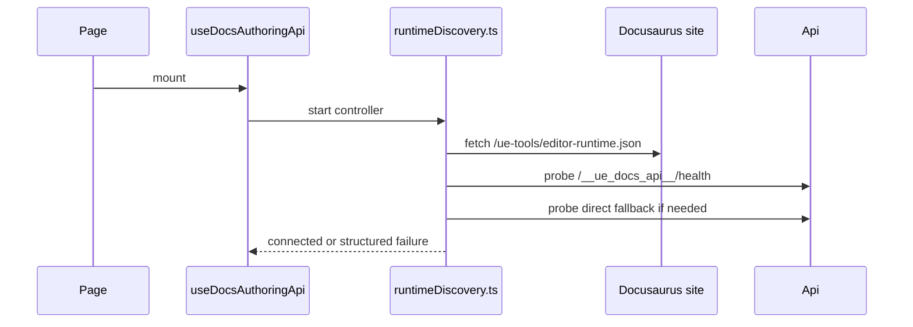

## 6. Health identity validation

Source anchors: `compareRuntimeIdentity`, `probeApiBase`.

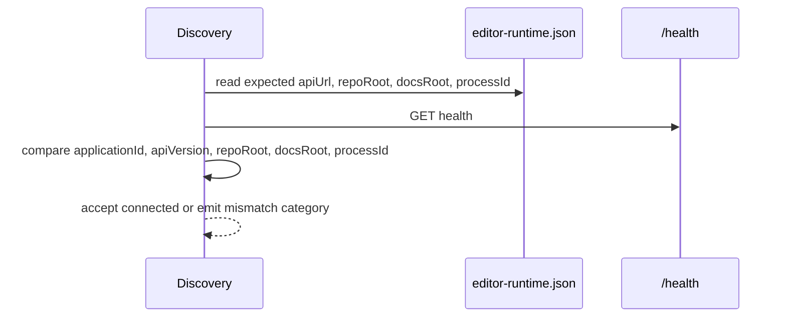

## 7. Site Settings initialization

Source anchors: `site-settings.tsx`, `SiteAdminPanel.tsx`.

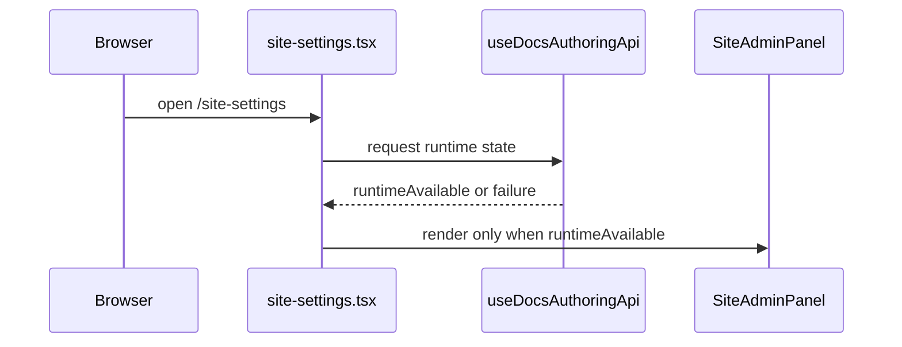

## 8. Normal document-page initialization

Source anchors: `DocItem/Layout/index.tsx`, `docPageAuthoring.ts`.

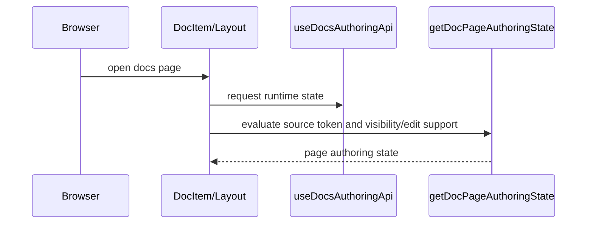

## 9. Edit document load

Source anchors: `DocItem/Layout/index.tsx`, `GET /api/content`.

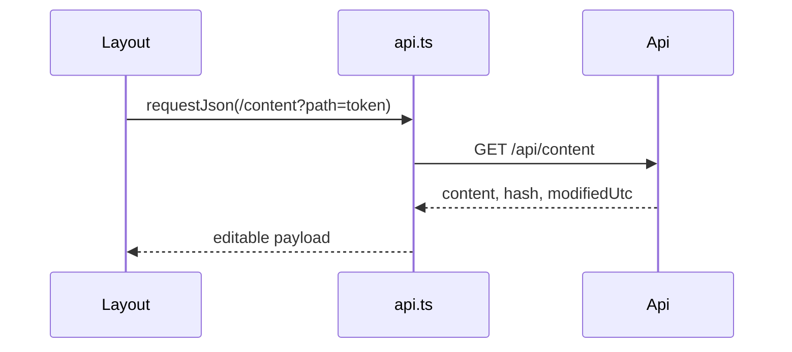

## 10. Edit document save

Source anchors: `Save-DocsContent`, `POST /api/content`.

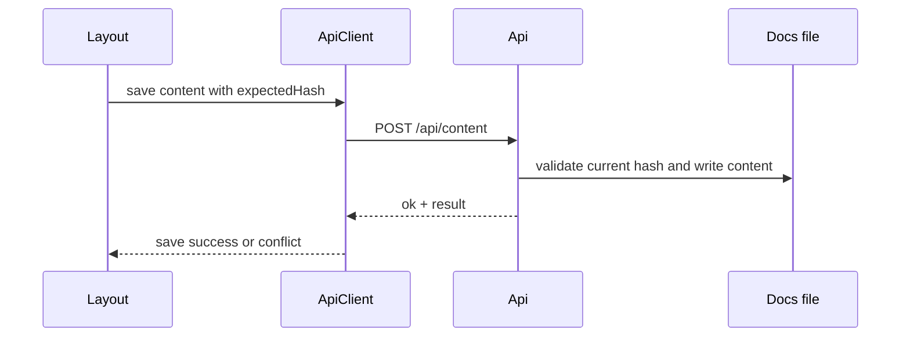

## 11. Hide document

Source anchors: `Set-DocsPageVisibility`, Case `3f`.

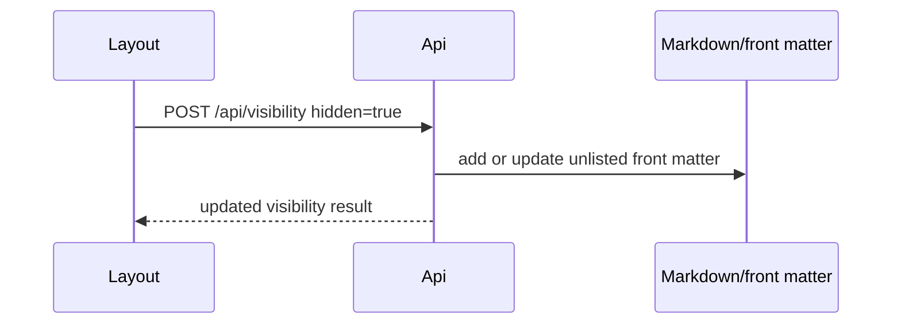

## 12. Show document

Source anchors: same as hide flow.

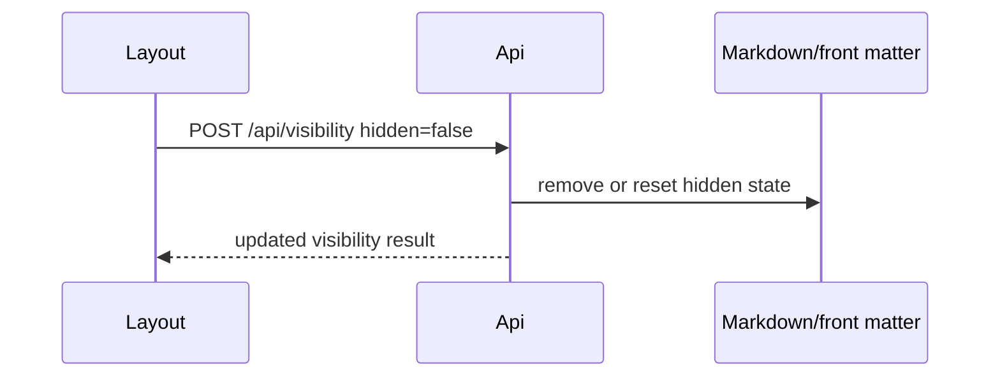

## 13. Create domain

Source anchors: `Create-DocsDomain`, `POST /api/create/domain`.

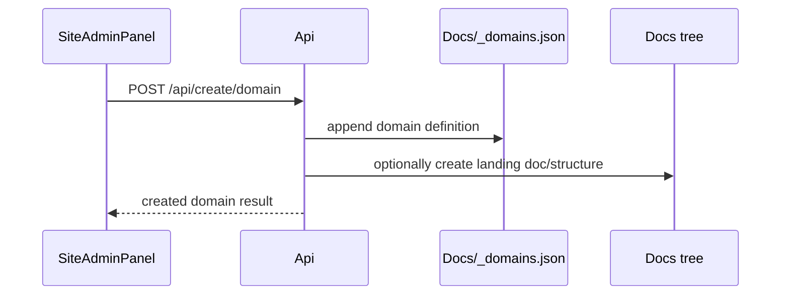

## 14. Move section into domain

Source anchors: `Move-DocsNode`, cross-domain tests Cases `1h` and `1i`.

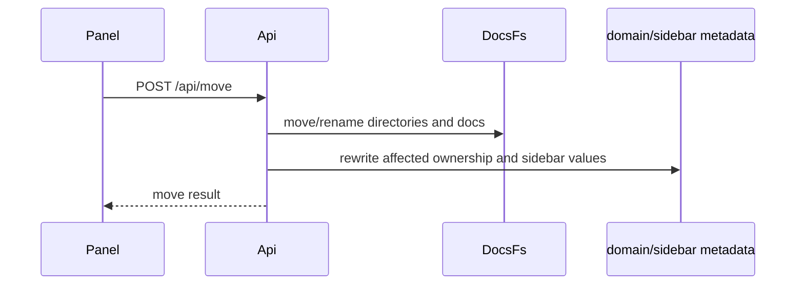

## 15. Navbar/sidebar refresh

Source anchors: `domainCatalog.ts`, frontend structure-change broadcast.

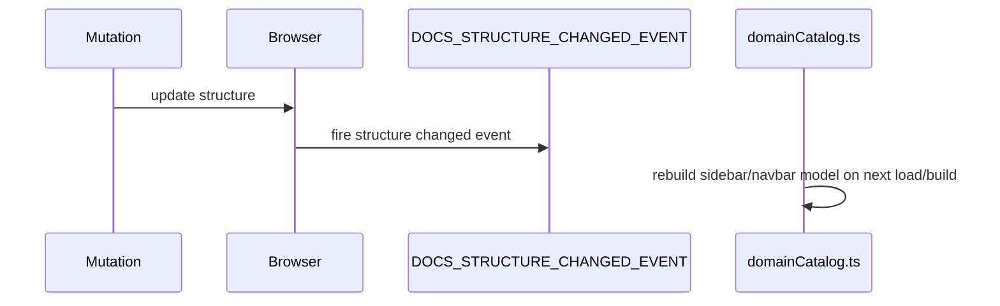

## 16. API shutdown

Source anchors: `Stop-DocsEditorApiBackground`.

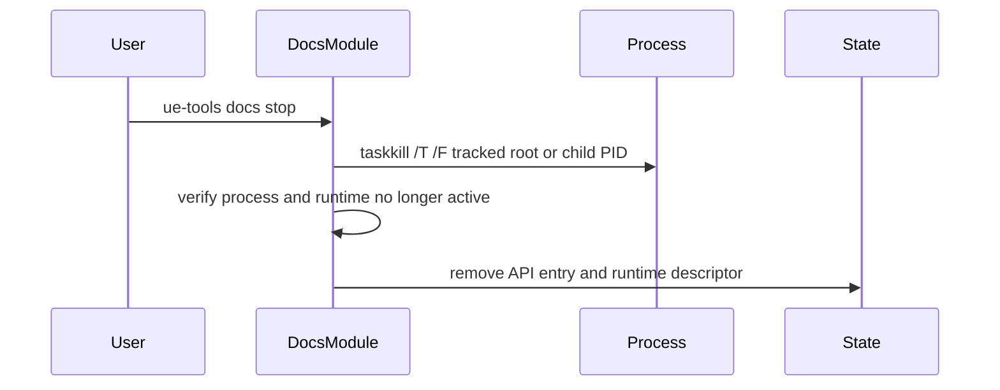

## 17. Stale descriptor recovery

Source anchors: `Get-DocsEditorApiStatus`, `Invoke-DocsStatus`.

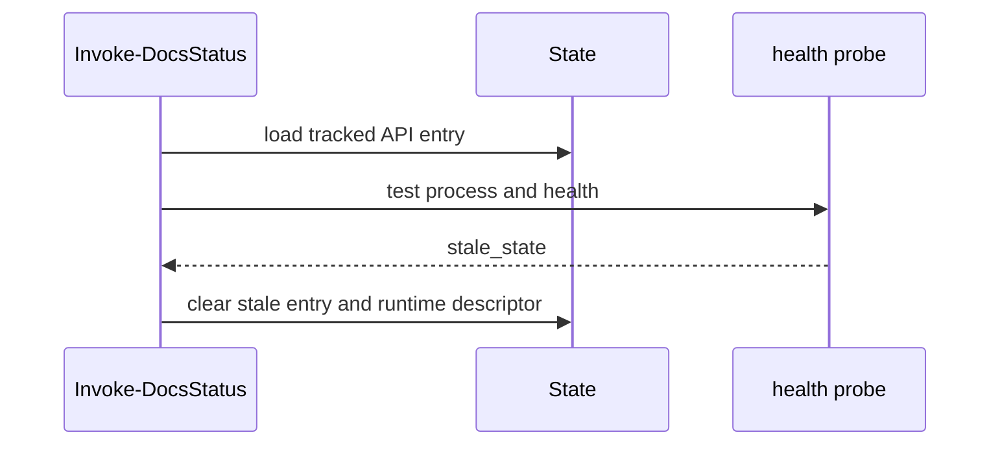

## 18. Frontend reconnection after API restart

Source anchors: `createAuthoringConnectionController`, retry backoff list.

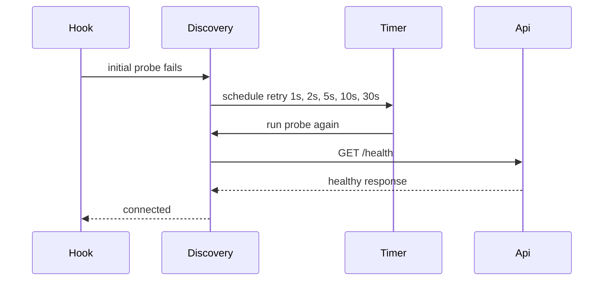

## 19. Website source-to-served-bundle deployment

Source anchors: `payload/website/package.json`, installer website copy logic, packaging tests.

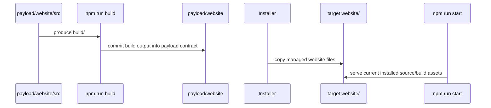

## 20. Relevant test execution

Source anchors: `Tests/Run-UEToolSuiteTests.ps1`, `Tests/ToolSuiteManifest.ps1`.

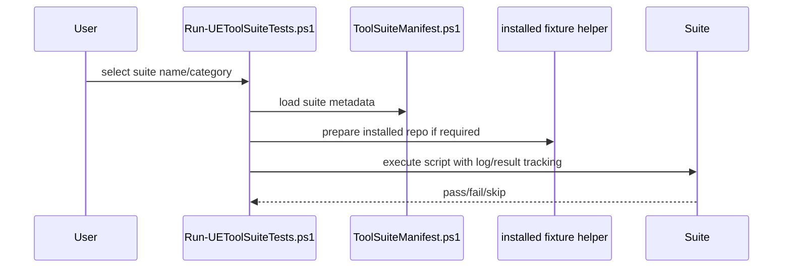
